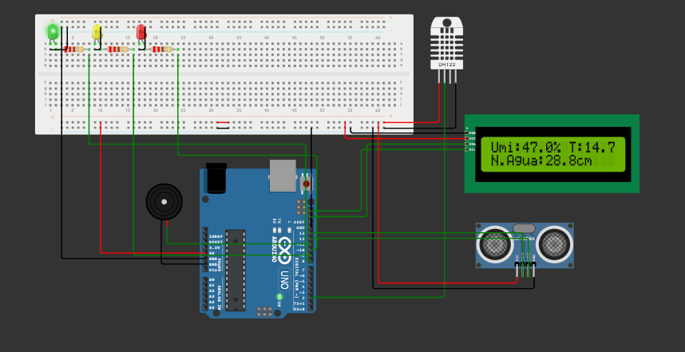

<h1 align="center">🌊 EnchenteZero</h1>
<p align="center">
  <strong>Sistema Físico de Monitoramento de Enchentes</strong><br>
  Global Solution 2025.1 • FIAP • Edge Computing & IoT
</p>

---

## 🚀 Tecnologias Utilizadas


---

## 🧰 Componentes Utilizados

- Sensor Ultrassônico HC-SR04 – Nível de água
- Sensor DHT22 – Umidade e Temperatura do ar
- Display LCD 16x2 com I2C
- LEDs Verde, Amarelo e Vermelho – Indicadores de alerta
- Buzzer – Alarme sonoro em caso crítico
- Arduino UNO R3

---

## 🎯 Objetivo do Projeto

Desenvolver um sistema automatizado que **monitore enchentes em tempo real** utilizando sensores e atue por meio de sinais visuais e sonoros, prevenindo tragédias em áreas de risco.

---

## ⚙️ Funcionalidades

✅ Medição em tempo real de umidade, temperatura e nível da água  
✅ Exibição dos dados no LCD com animação inicial personalizada  
✅ Alerta com LEDs: verde (normal), amarelo (atenção), vermelho (risco crítico)  
✅ Alarme sonoro com buzzer em caso de risco elevado  
✅ Animação de enchente decrescente no início do sistema  
✅ Mensagens motivacionais: "Tecnologia para salvar vidas"  

---

## 📺 Interface de Exibição (LCD)

```text
Linha 0: Umi: 65.4% T: 27.3C
Linha 1: N.Agua: 123.5cm
```

---

## 🚨 Sistema de Alerta

- 🟢 LED Verde: Situação normal
- 🟡 LED Amarelo: Atenção – umidade ou nível elevado
- 🔴 LED Vermelho + Buzzer: Risco de enchente!

---

## 🤖 Lógica Inteligente

- Cálculo da distância da água com base no tempo de eco
- Análise cruzada com umidade do ar
- Sistema não repete animação após o boot

---

## 🧪 Simulação Online

🔗 [Clique para testar no Wokwi](https://wokwi.com/projects/432212007739369473)

---

## 🎥 Demonstração em Vídeo

📺 [Assista no YouTube](https://youtu.be/c0FJ4rCzEDI)

---

## 🖼️ Ilustração do Projeto

<p align="center">
  
</p>

---

## 👤 Desenvolvido por

- **Jean Carlos Rodrigues da Silva**  
- RM: 566439  
- Curso: Engenharia de Software – FIAP (2025.1)

- **Enrico Gianni Nóbrega Puttini**  
- RM: 561400  
- Curso: Engenharia de Software – FIAP (2025.1)

---

## 📄 Licença

Projeto acadêmico para fins educacionais. Reutilização permitida com citação do autor.
